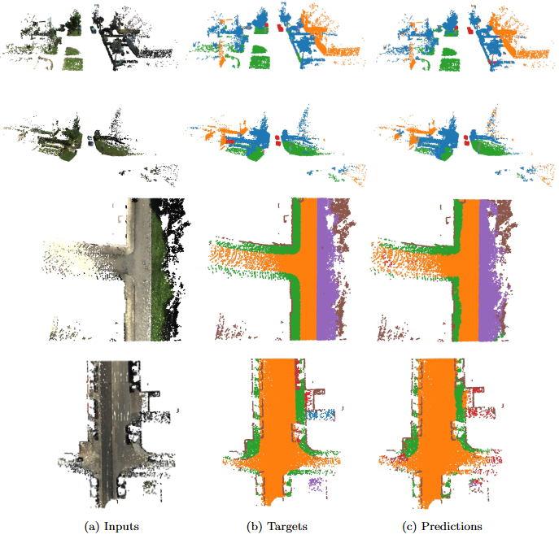
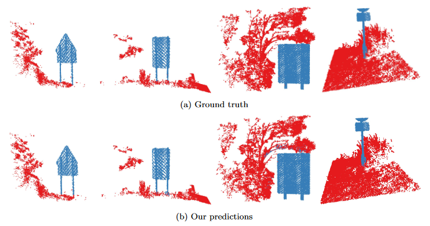
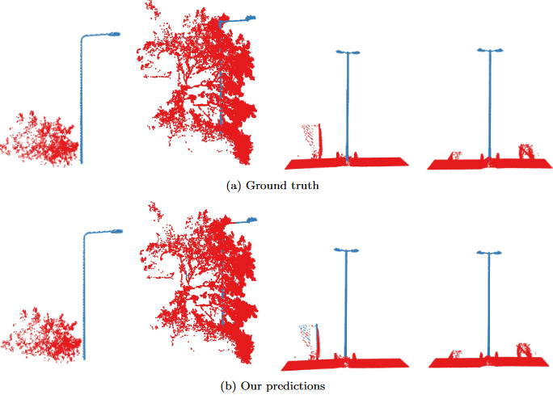
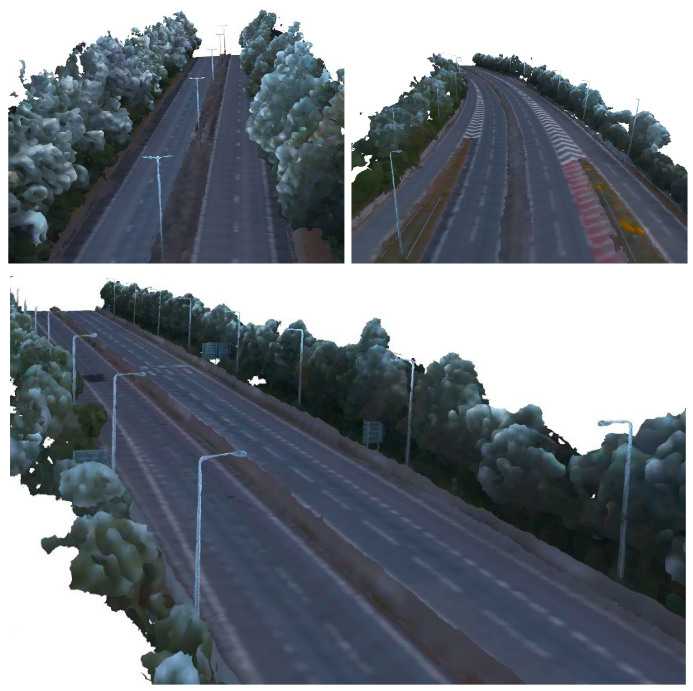

# GDT
# Geometric Digital Twin for roads 
## Part 1. Segmentation of road point clouds
This repository contains code for segmenting road environments for the following papers:

[Using Road Design Priors to Improve Large-Scale 3D Road Scene Segmentation](https://ascelibrary.org/doi/abs/10.1061/9780784485224.002)

[Automating Construction of Road Geometric Digital Twins Using Context and Location Aware Segmentation](https://papers.ssrn.com/sol3/papers.cfm?abstract_id=4767693)

Context-aware segmentation examples with [KITTI360](https://www.cvlibs.net/datasets/kitti-360/) dataset (Multiclass segmentation separately on groun and non ground points (input is XYZRGB+eigenvalues+normals+trajectory based partitioning))

Location-aware segmentation examples with [Digital Roads](https://drf.eng.cam.ac.uk/research/digital-roads-dataset) dataset (Binary segmentation after cutting out extended bounding boxes (BB) around furniture (input is XYZRGB+BB partitioning)

This code currently supports PointNet++.

### Assumptions:
This repo code assumes that ground is already separated and partitioned for context-aware segmentation and bounding box partitioning is already done for location aware segmentation. See the dataset classes for the required format. This preprocessing will be available soon in a different repo.

### How to use:
1. Clone the repository
2. Install the required packages (requirements.txt will be available soon)
3. Configure the parameters in the config file ``init.py``
4. Run the main file ``pc_dl_pipeline.py``

The code supports KITTI360 and Digital Roads datasets.

## Part 2. Meshing pipeline 
See different repository (to be available soon).

Examples on Digital Roads dataset:
