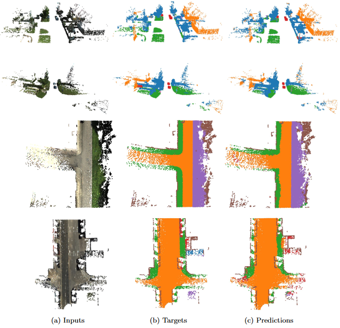
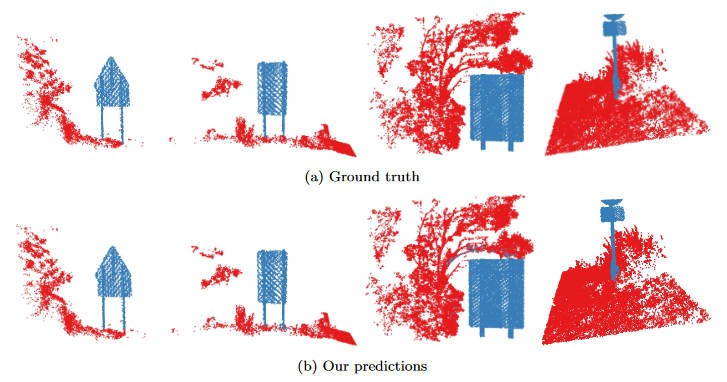
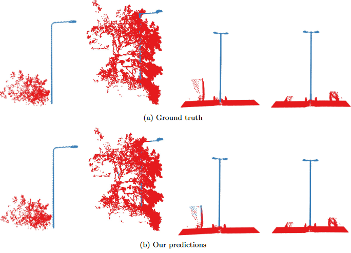
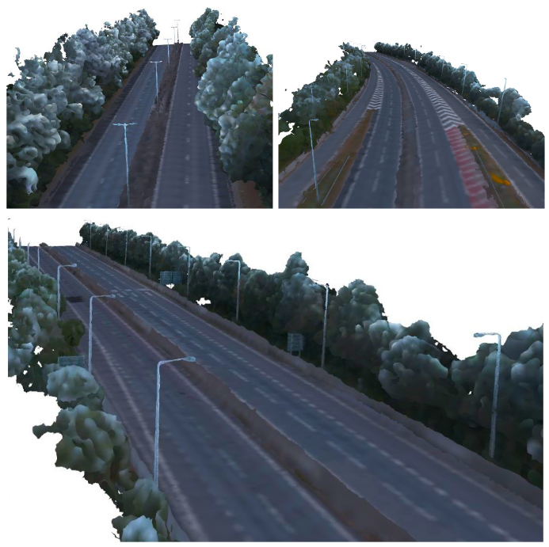

# GDT
# Geometric Digital Twin for roads 
# 🛣️ Road Digital Twin Geometry — Automated from Point Clouds

> **"Scalable, affordable, and fully automatic 3D geometric digital twinning for roads."**

Building road digital twins is expensive. We make it not.

This repository implements the method from **"Automating construction of road digital twin geometry using context and location aware segmentation"** (Davletshina, Reja & Brilakis, *Automation in Construction*, 2024) — a fully automated pipeline that turns raw point clouds into meshed, coloured, and semantically labelled 3D road models.

---

## 🏆 Results at a Glance

| Dataset | Metric | Score |
|---|---|---|
| Digital Roads | mIoU (road furniture) | **91.7%** |
| KITTI360 | vs. leaderboard leader | **+16.93%** |

Zero manual intervention required.

## 🏅 Award

This paper was awarded the **[Thorpe Medal 2025](https://ec-3.org/awards/thorpe-medal/)** by the
[European Council on Computing in Construction (EC³)](https://ec-3.org) —
recognising outstanding contribution to the practical and research aspects of
engineering informatics in the built environment.

---

## What It Does

Raw LiDAR point cloud goes in → structured, semantically rich road geometry comes out.

The pipeline handles the hard stuff:
- **Context- and location-aware segmentation** of challenging road furniture (signs, barriers, poles, markings)
- **Automatic ground classification**
- **3D mesh generation** with colour and semantic labels
- Driven by prior domain knowledge — generalises without retraining from scratch

---

## Part 1. Segmentation of road point clouds
This repository contains code for segmenting road environments for the following papers:

[Using Road Design Priors to Improve Large-Scale 3D Road Scene Segmentation](https://ascelibrary.org/doi/abs/10.1061/9780784485224.002)

[Automating Construction of Road Geometric Digital Twins Using Context and Location Aware Segmentation](https://www.sciencedirect.com/science/article/pii/S0926580524005314)


Context-aware segmentation examples with [KITTI360](https://www.cvlibs.net/datasets/kitti-360/) dataset (Multiclass segmentation separately on groun and non ground points (input is XYZRGB+eigenvalues+normals+trajectory based partitioning))


Location-aware segmentation examples with [Digital Roads](https://drf.eng.cam.ac.uk/research/digital-roads-dataset) dataset (Binary segmentation after cutting out extended bounding boxes (BB) around furniture (input is XYZRGB+BB partitioning)



This code currently supports PointNet++.

### Assumptions:
This repo code assumes that ground is already separated and partitioned for context-aware segmentation and bounding box partitioning is already done for location aware segmentation. See the dataset classes for the required format. This preprocessing will be available soon in a different repo.

### How to use:
1. Clone the repository
2. Install the required packages using ``pip install -r requirements.txt``, but before that install torch related libs yourself following their guidelines depending on your system and cuda version. I left torch libs in requirements.txt for reference of versions
3. Configure the parameters in the config file ``init.py``
4. Run the main file ``pc_dl_pipeline.py``

The code supports KITTI360 and Digital Roads datasets.

## Part 2. Meshing pipeline 
See different repository (to be available soon).

Examples on Digital Roads dataset:



## Questions and suggestions
Please create GitHub issues for any questions or suggestions.

## Pretrained models 
Will be available soon.

## Citation

Please cite these papers if you use this code in your research:

``` 
@incollection{davletshina2023using,
  title={Using Road Design Priors to Improve Large-Scale 3D Road Scene Segmentation},
  author={Davletshina, Diana and Brilakis, Ioannis},
  booktitle={Computing in Civil Engineering 2023},
  pages={9--16},
  year={2023}
}
```

```
@article{DAVLETSHINA2024105795,
title = {Automating construction of road digital twin geometry using context and location aware segmentation},
journal = {Automation in Construction},
volume = {168},
pages = {105795},
year = {2024},
issn = {0926-5805},
doi = {https://doi.org/10.1016/j.autcon.2024.105795},
url = {https://www.sciencedirect.com/science/article/pii/S0926580524005314},
author = {Diana Davletshina and Varun Kumar Reja and Ioannis Brilakis},
keywords = {Geometric digital twins (GDT), Deep learning, Roads, Segmentation, 3D reconstruction, Point clouds, Meshing, Road assets, Scene understanding, Automation},
abstract = {Geometric Digital Twins (GDT) represent a critical advancement in road management, yet their practical implementation encounters a substantial obstacle due to development costs outweighing the expected benefits. This paper addresses this challenge and introduces an automated solution for creating 3D geometric foundation models for road digital twins. The proposed approach utilises point clouds to generate meshed, coloured, and semantically labelled models of road objects. The proposed solution incorporates context- and location-aware segmentation, followed by a 3D representation step via meshing. Experiments showed that the solution achieves a 91.7% mean intersection over union segmentation on road furniture in the Digital Roads dataset and surpasses the current leader on the KITTI360 dataset by +16.93%. As a result, the fully automatic method enables scalable and affordable geometry digital twinning for roads.}
}

```
